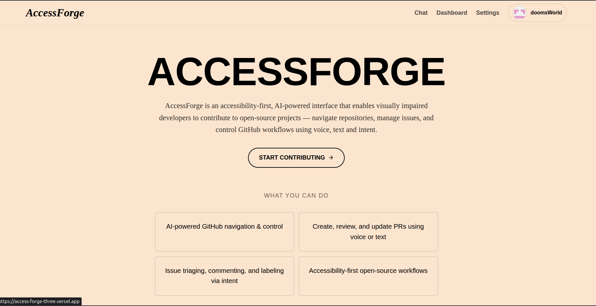
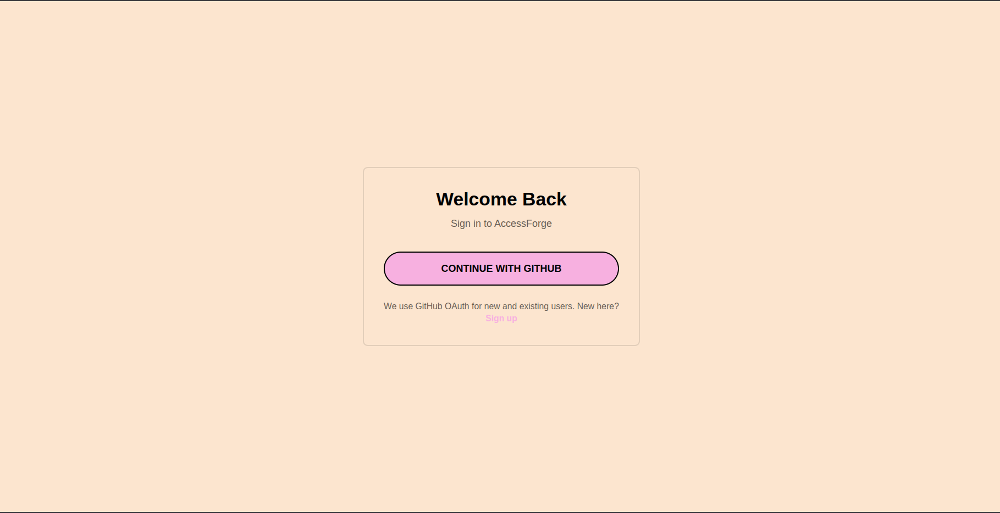
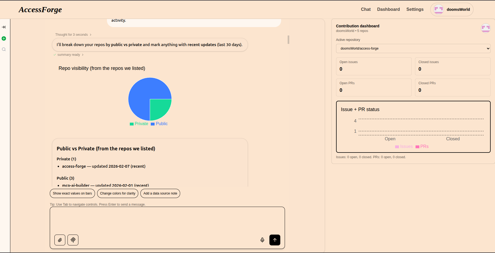
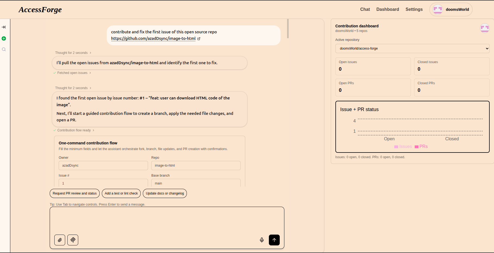
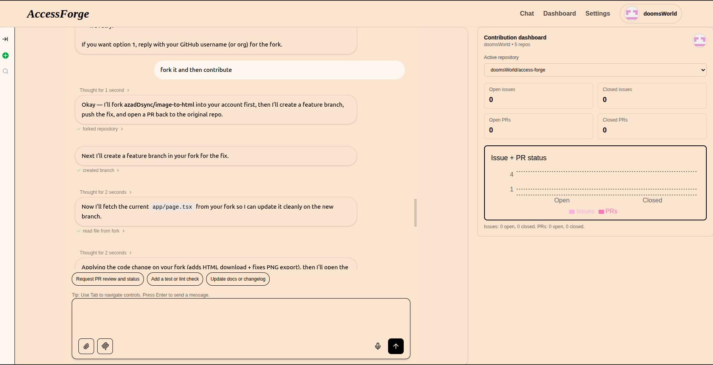
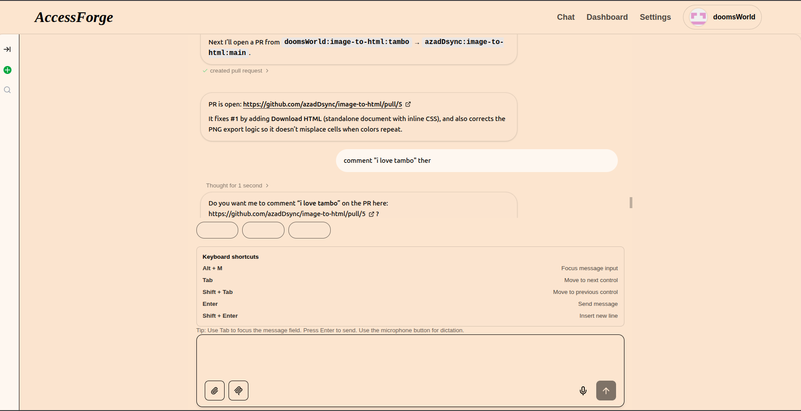
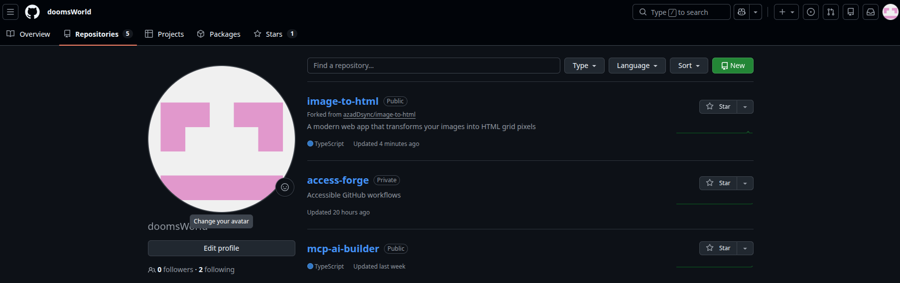
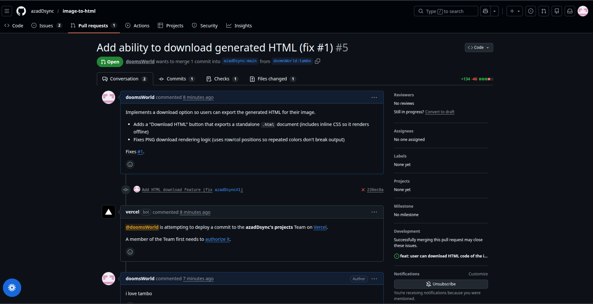
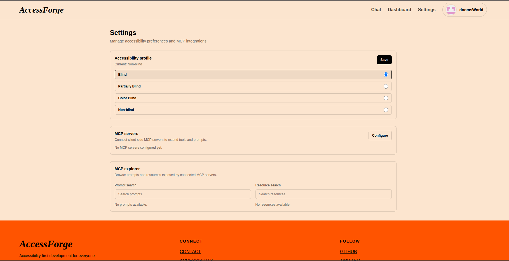

# AccessForge

AccessForge is an accessibility-first, AI-powered GitHub workspace that helps visually impaired developers and inclusive teams contribute to open-source projects. It combines a guided chat assistant, interactive UI components, and GitHub MCP tooling so users can navigate repos, triage issues, and open PRs without leaving the app.

## About the Project

AccessForge removes barriers for visually impaired developers by providing a fully accessible interface for GitHub contributions. Instead of navigating complex web UIs, users describe their intent in natural language and the AI handles repository exploration, issue triage, branch creation, and PR submission—all with voice, text, and keyboard navigation. The system adapts its UI based on user accessibility profiles (blind, partially-blind, color-blind, non-blind) to ensure everyone can contribute effectively.

Built with Tambo AI as the core conversational layer, AccessForge demonstrates how generative UI and MCP (Model Context Protocol) integrations can create inclusive developer tools that reduce friction for underrepresented contributors while maintaining transparency and safety through explicit confirmation workflows.

## Highlights

- Accessibility profiles for blind/low-vision, color-blind, and non-blind users.
- Generative UI: AI renders charts, cards, and contribution flows with schema-validated props.
- GitHub MCP actions for repo, issue, and PR workflows with explicit confirmation.
- Dashboard + AI studio layout with quick-start prompts.
- Keyboard shortcuts, screen reader tours, and voice input support.

## Tech Stack & Architecture

### Core Technologies
- **Next.js 15** (App Router) + **React 19** – Server and client components with streaming
- **Tambo AI SDK** – Conversational AI, generative UI, and MCP integration
- **Better Auth** – GitHub OAuth with session management
- **Prisma 7** + **PostgreSQL** – Database ORM with Prisma Accelerate adapter
- **Tailwind CSS v4** – Utility-first styling with dark mode support

### Architecture Layers

1. **Accessibility Layer** ([src/components/accessibility](src/components/accessibility))
   - Profile detection and persistence
   - Adaptive UI layouts (visual vs non-visual workflows)
   - Screen reader guidance and keyboard shortcuts

2. **AI & Generative UI** ([src/lib/tambo.ts](src/lib/tambo.ts))
   - Component registration with Zod schemas
   - Tool registration for GitHub actions
   - Streaming responses and real-time UI updates

3. **GitHub Integration** ([src/services/github-oauth-tools.ts](src/services/github-oauth-tools.ts))
   - OAuth-backed API calls for repo/issue/PR actions
   - MCP tools for confirmed write operations (fork, branch, commit, PR)
   - Dashboard analytics with live activity tracking
   - **Custom GitHub Tools** (implemented in this project):
     - `listGitHubRepos` – Browse user repositories with filters
     - `getGitHubRepo` – Fetch repository details and metadata
     - `createGitHubRepo` – Create new repositories with confirmation
     - `listGitHubIssues` – Query issues by label, state, or assignee
     - `getGitHubIssue` – Retrieve full issue details and comments
     - `updateGitHubIssue` – Modify issue state, title, or body
     - `addGitHubIssueComment` – Post comments on issues
     - `addGitHubIssueLabels` – Apply labels for organization
     - `createGitHubPullRequest` – Open PRs with title, body, and branch refs
     - `createGitHubBranch` – Create feature branches from base
     - `createGitHubFork` – Fork repositories to user account
     - `upsertGitHubFile` – Create or update files with commits
     - `listGitHubRepoTree` – Explore repository file structure
     - `getGitHubFileContent` – Read file contents from repos
     - `searchGitHubCode` – Search code across repositories

4. **Database & Auth** ([src/lib/auth.ts](src/lib/auth.ts), [src/lib/prisma.ts](src/lib/prisma.ts))
   - Better Auth with GitHub provider
   - User ability profiles stored in Prisma
   - Session-based access token management

## Demo

🔗 **Live Demo**: [https://access-forge-three.vercel.app](https://access-forge-three.vercel.app)

### Screenshots

#### Homepage

*Landing page with accessibility-first design and quick access to features*

#### Sign In with GitHub

*GitHub OAuth authentication flow with accessibility profile setup*

#### Dashboard Overview

*GitHub repository analytics with live activity tracking and AI-powered insights*

#### Analytics View

*Real-time chart generation and interactive data visualization*

#### Contribution Flow - Start

*Initial step of guided PR creation with accessibility checks*

#### Contribution Flow - Mid

*Confirming changes and reviewing PR details*

#### Contribution Flow - End

*Successful PR submission with confirmation*

#### Fork Repository

*Forking workflow with MCP tool confirmation*

#### PR Comments

*Adding comments to pull requests through conversational interface*

#### Accessibility Settings

*User preferences and accessibility profile configuration*

### Key Workflows

1. **Sign in with GitHub** → AccessForge requests repo access via OAuth
2. **Chat Interface** → Ask "List my repositories" or "Find accessibility issues in [repo]"
3. **Dashboard** → View live repo analytics with charts and activity trends
4. **Contribution Flow** → Say "Open a PR to fix issue #42" and follow the guided steps
5. **AI Studio** → Generate charts on demand, pin them to the canvas for reference

## Learning & Growth

Building AccessForge taught us:

- **Accessibility is design, not afterthought**: Every interaction pattern—from focus indicators to voice input—requires intentional design for users with different abilities.
- **AI needs guardrails for safety**: Explicit confirmation before destructive actions (commits, PRs) builds trust in AI-assisted workflows.
- **MCP unlocks real actions**: Tambo's MCP integration turned the assistant from a chatbot into a true workspace tool by connecting it to live GitHub APIs.
- **Streaming UI improves UX**: Real-time component generation and progressive updates keep users engaged during longer AI responses.
- **Schema validation prevents errors**: Using Zod to validate AI-generated component props caught edge cases early and made debugging easier.

## Getting Started

1) Install dependencies

```bash
npm install
```

2) Copy env file

```bash
cp example.env.local .env.local
```

3) Set required environment variables

```plaintext
NEXT_PUBLIC_TAMBO_API_KEY=...
NEXT_PUBLIC_CLIENT_URL=http://localhost:3000
NEXT_PUBLIC_API_URL=http://localhost:3000
BETTER_AUTH_URL=http://localhost:3000
BETTER_AUTH_SECRET=replace-with-a-secure-secret
GITHUB_CLIENT_ID=your-github-client-id
GITHUB_CLIENT_SECRET=your-github-client-secret
DATABASE_URL=postgresql://...
```

4) Generate Prisma client

```bash
npx prisma generate --schema prisma/schema.prisma
```

5) Run the app

```bash
npm run dev
```

Open http://localhost:3000

## GitHub OAuth Setup

Create a GitHub OAuth App and set these URLs:

- Homepage URL: http://localhost:3000
- Callback URL: http://localhost:3000/api/auth/callback/github

For production, replace with your deployed domain.

## Tambo Integration

- Component and tool registration: [src/lib/tambo.ts](src/lib/tambo.ts)
- Tambo provider wiring: [src/app/chat/page.tsx](src/app/chat/page.tsx) and [src/app/dashboard/page.tsx](src/app/dashboard/page.tsx)
- Generative UI components: [src/components/tambo](src/components/tambo)

## Accessibility Features

- **Profile-based UI Adaptation**: Accessibility mode persistence and UI adaptations: [src/components/accessibility/AccessibilityProvider.tsx](src/components/accessibility/AccessibilityProvider.tsx)
- **Screen Reader Support**:
  - All AI responses announced via `aria-live="polite"` regions
  - Message content labeled with `aria-label` for context
  - Screen reader tour and keyboard shortcuts help
  - Semantic HTML with proper ARIA roles
- **Keyboard Navigation**:
  - Full keyboard access to all interactive elements
  - Custom keyboard shortcuts for common actions
  - Focus indicators on all interactive components
- **Visual Adaptations**:
  - High contrast mode support
  - Color-blind safe palettes with text labels
  - Adaptive chat layout for visual vs non-visual workflows
- **Voice Input**: Compatible with browser speech recognition APIs

## Useful Scripts

- `npm run dev` – run locally
- `npm run build` – production build
- `npm run start` – serve build
- `npm run lint` – lint

## Project Structure

```
src/
  app/            # Routes (chat, dashboard, auth, settings)
  components/     # UI + Tambo components
  lib/            # Auth, Prisma, Tambo config
  services/       # GitHub + analytics services
  generated/      # Prisma client output
```

## Deployment Notes (Vercel)

Make sure all env vars above are set in Vercel. For GitHub OAuth in production:

- Homepage URL: https://your-domain.vercel.app
- Callback URL: https://your-domain.vercel.app/api/auth/callback/github

---

Built with Tambo AI. Docs: https://docs.tambo.co
